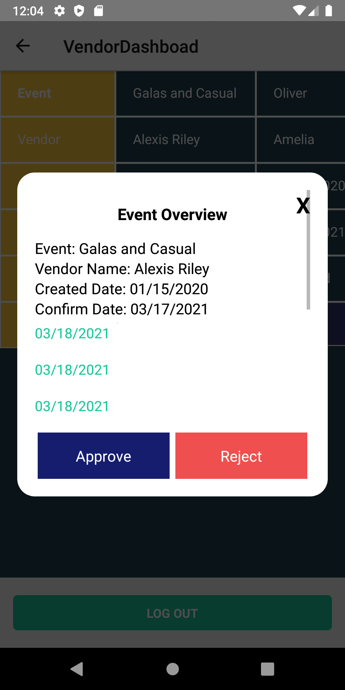

<h1 align="center">
  <br>
  <a ></a>
  <br>
  Wellness Booking
  <br>
</h1>

<h4 align="center">A minimal Wellness Booking mobile app built on top of <a href="https://reactnative.dev/" target="_blank">React Native</a>.</h4>

<p align="center">
  <a href="#key-features">Key Features</a> •
  <a href="#how-to-use">How To Use</a> •
  <a href="#credits">Credits</a>
</p>

## Key Features

- Manage wellness booking event
- Allows users to login with username and password
- Company HR Admin Dashboard

  - A simple table with a list of created events these fields:
    - Event Name-Vendor
    - Name-Confirmed Date
    - Status-Date Created
    - View button

- Vendor Admin Dashboard
  - A simple table with a list of created events these fields:
    - Event Name-Vendor
    - Name-Confirmed Date
    - Status-Date Created
    - Individual Rows will also one button: `View`

## How To Use

To clone and run this application, you'll need [Git](https://git-scm.com) and [Node.js](https://nodejs.org/en/download/) (which comes with [npm](http://npmjs.com)) installed on your computer. From your command line:

```bash
# Clone this repository
$ git clone https://github.com/duongnq2798/booking_wellness.git

# Go into the repository
$ cd booking_wellness

# Install dependencies
$ npm install

# Run the app for android
$ npm run android

# Run the app for ios
$ cd booking_wellness/ios
$ pod install
$ npm run ios
```

Note: If you're using Linux Bash for Windows, [see this guide](https://www.howtogeek.com/261575/how-to-run-graphical-linux-desktop-applications-from-windows-10s-bash-shell/) or use `node` from the command prompt.

## Credits

This software uses the following open source packages:

- [React Native](https://reactnative.dev/) : Create native apps for Android and iOS using React
- [React Navigation](https://reactnavigation.org/) : Routing and navigation for your React Native apps
- [React Native Modal](https://github.com/react-native-modal/react-native-modal) : An enhanced, animated and customizable react-native modal.
- [React Native Date Picker](https://github.com/henninghall/react-native-date-picker) : A cross platform react native date picker component for android and ios. It includes 3 different modes: date, time, and datetime. The date picker is customizable and has multiple language support.

## Login Account

Hr Admin Dashboard

- Account: `hradmin@gmail.com`
- Password: `hradmin`

Vendor Admin Dashboard

- Account: `vendoradmin@gmail.com`
- Password: `vendoradmin`

- Design Flow
  [Preview Design Flow](https://www.figma.com/file/o6cTJqBc2fqQvOO1gLdj15/Booking-Wellness-Sytem?node-id=0%3A1)

---

## COMPANY HUMAN RESOURCE ACCOUNTS

<div style="display:flex, margin: 20px, flex: wrap">
     
     
     
     
     
</div>

## VENDOR ACCOUNTS

<div style="display:flex, margin: 20px, flex: wrap">
     
     
     
     
     
     
     
     
     
</div>

## License

MIT

---

> [duongnq](https://duongnq2798.github.io/duongnq27) &nbsp;&middot;&nbsp;
> GitHub [@duongnq2798](https://github.com/duongnq2798) &nbsp;&middot;&nbsp;
> Twitter [@duongnq27](https://twitter.com/duongnq27)
